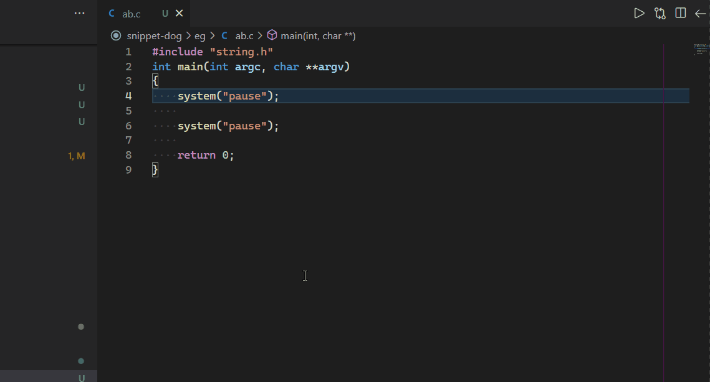

# C/C++/C# Snippets Plus (OutSide Code Supported)

This extension for Visual Studio Code adds snippets for C/C++/C# base On [kkonghao/snippet-dog](https://github.com/kkonghao/snippet-dog), Now add supportting Outside code like `Visual Studio`.

>这个扩展为Visual Studio Code 添加 C/C++/C# 代码段，现在添加支持外侧代码，就像 Visual Studio 2019，当你选择了文本之后，可以插入外侧包围。

for more information：[heartacker/snippet-plus](https://github.com/heartacker/snippet-dog.git)

## Recommendations

for better experience of outside code, **strongly** recommend that you should add an new keybinding for `insert snippet`, you can open the key setting by `ctrl+k ctrl+s` to open, and search `insert snippet` to add. like `ctrl+alt+i`;
after that you can select some codeblock and than trigger `insert snippet` in command palette to insert outside code.

>为了更好的体验外侧代码，**强烈**建议您为插入代码片段（`insert snippet`） 添加一个快捷键，你可以通过快捷键 `ctrl+k ctrl+s` 打开键盘设置，并搜索 `insert snippet` 添加。推荐使用`ctrl+alt+i`;之后，你就可以选择代码然后触发插入代码片段 来插入外侧代码了。

## Usage

C/C++/C# Snippets use Tab to change one position to another.

And Some Snippet is **OutSide Code Supported**, which is useful for **refactoring**, just like `Visual Studio`:

```c
int	main(int argc, char **argv)
{
    system("pause");
    return 0;
}
```

select  `system("pause");` and insert snippet like  `for`,

then that will embedd `system("pause");` by for loop;
```c
int	main(int argc, char **argv)
{
+    for (int lop = 0; lop < 10; lop++)
+    {
        system("pause");
+    }
}
```

There is the demo:


## Snippets

### C Snippets

recommend that installing the **official** [C/C++](https://marketplace.visualstudio.com/items?itemName=ms-vscode.cpptools) extension for better experience. 

**this extension only support *outside code* and other snippet that C/C++ don't have.**

### C++ Snippets

recommend that installing the **official** [C/C++](https://marketplace.visualstudio.com/items?itemName=ms-vscode.cpptools) extension for better experience. 

**this extension only support *outside code* and other snippet that C/C++ don't have.**

### C# Snippets

recommend that installing the **official** [C#](https://marketplace.visualstudio.com/items?itemName=ms-dotnettools.csharp) extension for better experience. 

**this extension only support *outside code* and other snippet that C# don't have.**


## Suggestions for improvement are welcome

